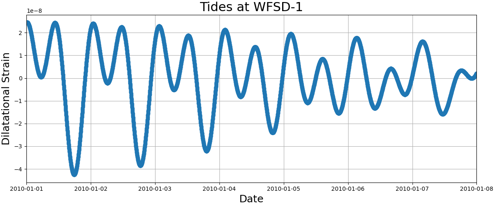
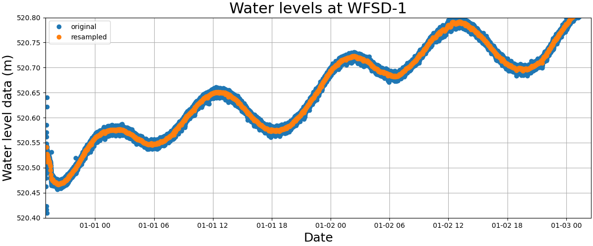
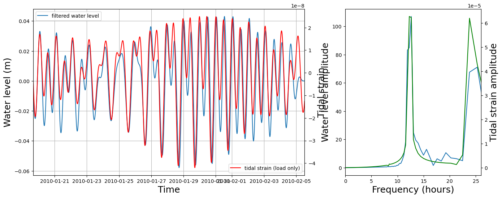
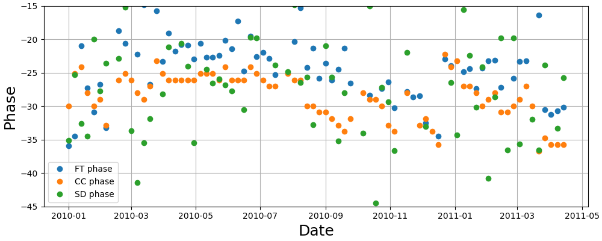
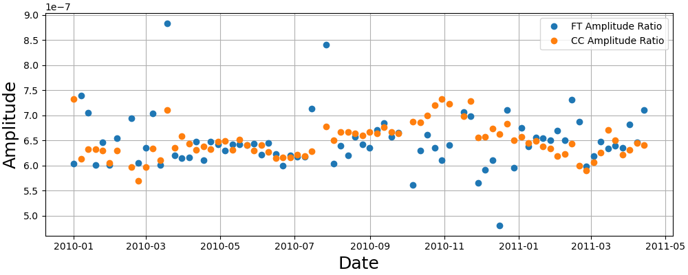

# Estimating permeability at the HSDP borehole from well response to tidal strain

## Description

This repository contains several scripts to estimate permeability using the response of wells to tidal strain.  We first attempt to reproduce the results of Xue et al. 2013 and then apply the same procedure to well data and tidal timeseries from the Hawaii Scientific Drilling Project borehole near Hilo, HI.  Maybe one day I/we will publish this and, if we do, you can cite the paper below if you find the scripts useful:

Thomas, A. M., and D. J DePaolo (2021) Calculating permeability in Hawaii.

BibTeX:

    @article{thomas2021hp,
        title={Calculating permeability in Hawaii},
        author={Thomas, Amanda M and D. J. DePaolo},
        journal={Who knows},
    }

## Requirements

In order to run the scripts you will need Python and basic packages such as Numpy and Scipy.  I recommend creating a [conda](https://docs.conda.io/en/latest/) environment and installing both packages into it.  You will also need to install [SPOTL](https://igppweb.ucsd.edu/~agnew/Spotl/spotlmain.html) to run the script that requires ertid.  

## Reproducing Xue et al. (2013)

### Step 1: Calculate the tides for WFSD-1 

Since WFSD-1 is far from the ocean I used only ertid (body load only) to calcuate the tides at the location listed in the paper (31.1°N, 103.7°E).  I calulated them for two years starting on 1/1/2010 with a sampling rate of two minutes using the script **for\_wenchuan.sh**.  This creates a file called xue_tides_2021 that has the north strain in column 1 and the east strain in column 2.  The times from SPOTL are in UTC--this will be important later.  To get the tidal dilatation we add the east and north strain; the units are nanostrain.  The calculated dilatation is shown in Figure 1 below.

### Step 2: Pull water level data from Xue et al. (2013) supplementary material

The file **waterlevel.csv** can be found in the supplement of the Xue paper.  The script **reproduce\_xue.py** reads in this file, converts the time stamps to the appropriate datetime format (making sure to correct Beijing time to UTC).  Since NaNs are present in the data, we first drop those, then we resample the data to 2 minute intervals.  This again introduces NaNs so we interpolate across no more than 2 consectutive NaN values.  If more consecutive NaNs are present we drop those values which creates a timeseries sampled every two minutes but with datagaps present.  You can see an example of the original and resampled timeseries in Figure 2 below.

### Step 3: Estimating phase

The script **reproduce\_xue.py** does the processing described below.

We now have the tidal timeseries, sampled at 2 minute intervals with no data gaps and the waterlevel timeseries sampled at 2 minute intervals but with data gaps.  Like Xue et al. (2013) we consider 29.6 day windows that overlap by 80%.  For each time window, we trim both the tides and waterlevel data to the window of interest.  Xue et al. (2013) dealt with data gaps by setting both timeseries to zero during those time periods but I was concerned about how these sharp discontinuities would be affected by subsequent filtering of the data and how this choice would affect cross-correlation or spectral division based estimates of phase that we employ here.  So, instead of setting data gaps to zero, we simply take the largest continuously sampled piece of timeseries in the window.  For example, if we have one week of continouus water level data, a week long data gap, and then 15.6 days of continouus water level data, our analysis would focus on the 15.6 day period.  We require the water level data be at least two weeks long to make phase and amplitude estimates.  Next, we cut the tidal data to the same start and end time as the water level data. Then, like Xue et al. (2013) we filter the water level data between 0.8 and 2.2 cycles per day using a fourth-order, zero-phase butterworth filter.  I double checked that this preserves amplitude and it mostly does but with some variation (this will be important later).  We estimate the phase in three different ways.  First, we calculate the spectra and calculate the difference between the phases of the 12.421 hour period (i.e. the M2 tide) frequency for the water level and tidal data (FT phase).  Second, we divide the spectra and calculate the phase of the 12.421 hour period (SD phase).  Third, we cross correlate the water level and tidal data to determine the lag that maximizes the normalized cross-correlation, then we convert this to a phase lag relative to the 12.421 hour period (CC phase).  An example time window showing tides and filtered water level data and their corresponding spectra are shown in figure 3.

The phases determined via each of these methods is shown in Figure 4 below.  A couple of points.  The phase angles do vary from method to method and their are outliers but they are usually consistent with each other and have the same general shape (i.e. temporal increases and decreases) as in Xue's Figure 3A.  However, these phase angles are generally larger than hers.  Her phases vary mostly between 20 and 25 degrees whereas mine are mostly between 25 and 30.  I have tried exploring this and cannot reproduce her values exactly.  I did not do an MCMC inversion but she says this is equivalent to spectral division.  The differences also could be due to the various decions made above on filter type (she does not say which type of filter she used), handling of data gaps, etc.

### Step 4: Estimating amplitude

For each of the windows described in the previous section we estimate the amplitude response in two ways.  First we simply take the ratio of the spectral amplitudes of the tidal dilatation to the water level at the period corresponding to the M2 tide (12.421).  Second, we shift the tidal timeseries by the lag such that it is aligned with the tidal dilataion.  We then take the median(abs(tidal dilatation)/abs(water level).  These estimates are shown in Figure 5 below and are generally consistent with those of Xue et al. (2013).  Her values are between 6\*10-7/m and 7\*10-7/m as are mine--with a bit more scatter though.

